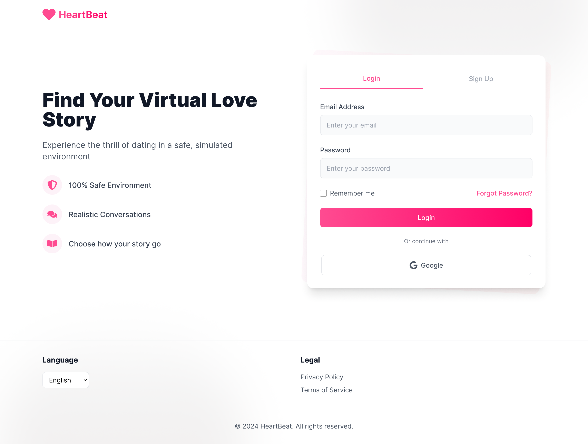
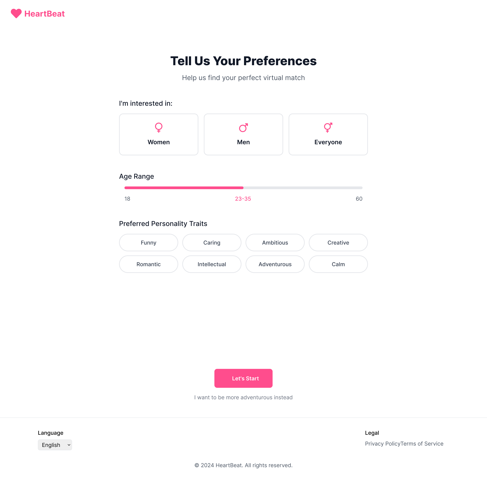
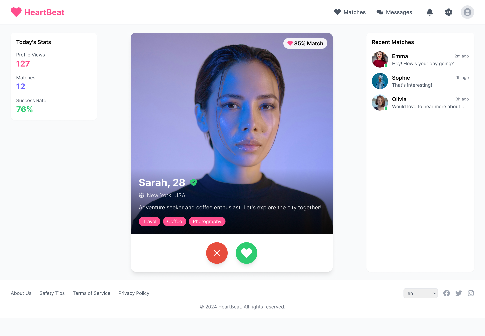

## This app is made purely from AI.

Using windsurf IDE, and Claude 3.7 Sonnet
This app is a study of AI and how it can be used to create a dating app or an app with less or no human intervention.

## Getting Started

First, run the development server:

```bash
yarn dev
```

Open [http://localhost:3000](http://localhost:3000) with your browser to see the result.

You can start editing the page by modifying `app/page.tsx`. The page auto-updates as you edit the file.

## Reference images:






